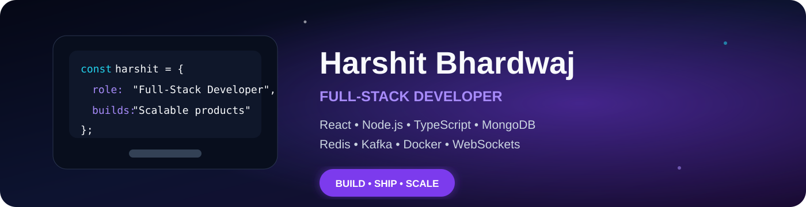
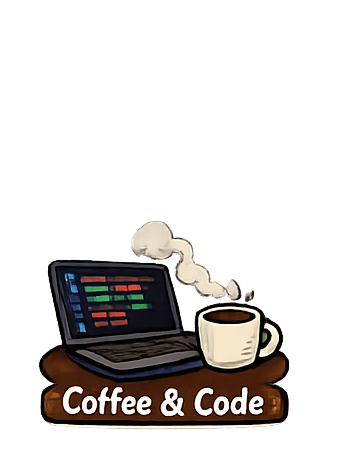
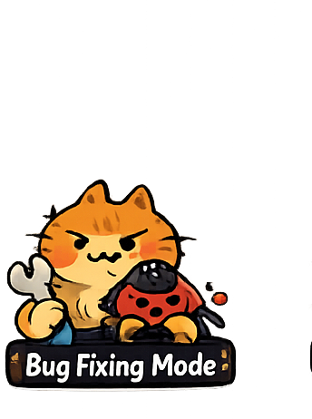
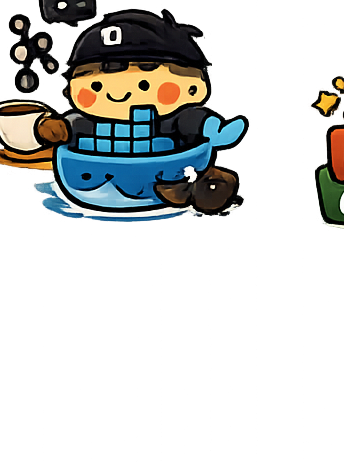
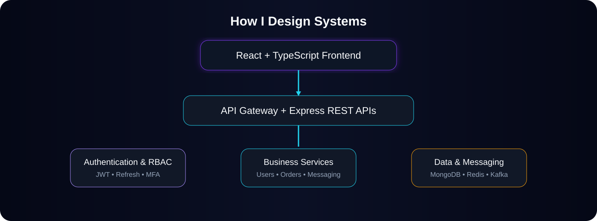

<div align="center">




<br/>

<a href="https://harshit-fullstack.vercel.app"></a>
<a href="https://www.linkedin.com/in/harshit-bhardwaj-125324287"></a>
<a href="mailto:bharshit63880@gmail.com"></a>

<br/><br/>


</div>


<div align="center">

## 👨‍💻 A Little About Me

</div>

```javascript
const harshit = {
  location: "Jhansi, Uttar Pradesh, India",
  role: "Full-Stack Developer",
  stack: ["React", "TypeScript", "Node.js", "Express", "MongoDB"],
  systems: ["Redis", "Kafka", "Socket.IO", "WebSockets", "Docker"],
  interests: [
    "Scalable REST APIs",
    "Microservices",
    "Event-Driven Architecture",
    "Authentication & Security",
  ],
  learning: ["System Design", "Cloud", "DevOps", "Distributed Systems"],
  openTo: [
    "Full-Stack Developer",
    "Backend Developer",
    "Frontend Developer",
    "Software Engineer",
  ],
};
```

<p align="center">
I build secure, responsive, and scalable applications with a strong focus on backend architecture, real-time communication, and complete end-to-end product development.
</p>

<div align="center">

## ✨ Developer Mood Board

<table>
<tr>
<td align="center"></td>
<td align="center"></td>
<td align="center"></td>
<td align="center"></td>
</tr>
<tr>
<td align="center"></td>
<td align="center"></td>
<td align="center"></td>
<td align="center"></td>
</tr>
</table>

</div>


<div align="center">

## 🛠️ My Engineering Universe

### Frontend


### Backend & Data


<br/>


### Architecture, DevOps & Tools


<br/>


</div>

<br/>




<div align="center">

## 🚀 Featured Projects

</div>

<table>
<tr>
<td width="50%" valign="top">

### 🔥 AllSpark
**Distributed online coding platform**

- Microservices architecture
- Judge0 code execution
- Kafka event streaming
- Redis caching
- WebSocket updates
- Contests, submissions, and RBAC

<a href="https://github.com/bharshit63880/AllSpark"></a>

</td>
<td width="50%" valign="top">

### 🛡️ SatyaShield
**Privacy-first reporting platform**

- Anonymous complaint workflows
- Secure authentication
- Evidence handling
- Role-based dashboards
- Real-time notifications
- Audit-oriented architecture

<a href="https://github.com/bharshit63880/SatyaShield"></a>

</td>
</tr>
<tr>
<td width="50%" valign="top">

### 🛕 DigiPandit
**Digital spiritual-services ecosystem**

- Pandit discovery and booking
- Astrology consultations
- Kundali workflows
- Hawan guidance
- Puja Samagri store
- User and expert dashboards

<a href="https://digipandit-web.vercel.app"></a>
<a href="https://github.com/bharshit63880/DIGIPANDIT"></a>

</td>
<td width="50%" valign="top">

### 💬 PulseChat
**Real-time messaging platform**

- Direct and group messaging
- Presence and typing indicators
- Delivery and read receipts
- Media sharing
- Socket.IO and Redis
- WebRTC audio-call foundation

<a href="https://github.com/bharshit63880/PulseChat"></a>

</td>
</tr>
<tr>
<td width="50%" valign="top">

### 🛒 Sastify
**Full-stack e-commerce platform**

- Product search and filters
- Cart and wishlist
- Checkout and order tracking
- Inventory management
- Admin dashboard
- Authentication and uploads

<a href="https://github.com/bharshit63880/Sastify"></a>

</td>
<td width="50%" valign="top">

### 🏡 RealStateX
**Property discovery platform**

- Listings and advanced search
- Image galleries
- Location-based discovery
- Role-based management
- Future AI recommendations


</td>
</tr>
</table>


<div align="center">

## 📊 Behind the Commits


<br/>


</div>

<div align="center">

## 🎯 Currently Leveling Up


</div>

<br/>

<div align="center">

## 🤝 Open to Meaningful Opportunities

Full-Stack Developer • Backend Developer • Frontend Developer • Software Engineer

<br/><br/>

<a href="https://harshit-fullstack.vercel.app"></a>
<a href="https://www.linkedin.com/in/harshit-bhardwaj-125324287"></a>
<a href="mailto:bharshit63880@gmail.com"></a>

<br/><br/>


</div>
