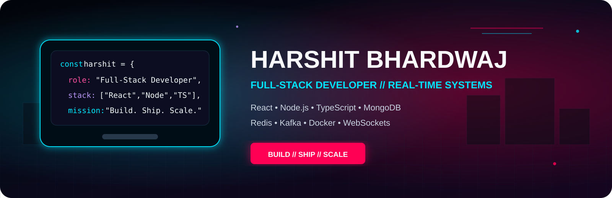
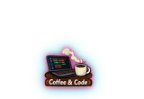
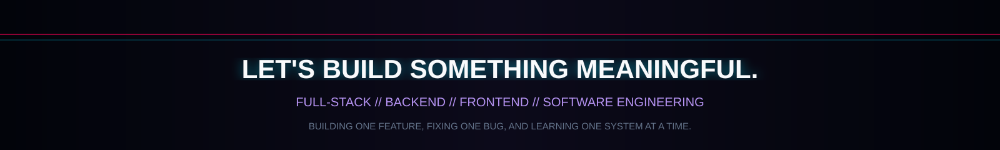

 

  

<table>
<tr>
<td width="190" align="center" valign="middle">

</td>
<td valign="middle">

## ABOUT ME

Full-Stack Developer focused on building **secure, scalable, production-minded, and real-time web applications**.

- Building complete products using React, TypeScript, Node.js, Express, and MongoDB
- Developing secure REST APIs, authentication systems, RBAC, and backend workflows
- Working with Redis, Kafka, Socket.IO, WebSockets, Docker, and microservices
- Experienced with real-time messaging, coding platforms, e-commerce systems, and service marketplaces
- Comfortable handling frontend, backend, databases, real-time communication, and deployment workflows
- Based in Jhansi, Uttar Pradesh, India
- Immediately available for Full-Stack, Backend, Frontend, and Software Engineer roles

</td>
</tr>
</table>

<table>
<tr>
<td width="190" align="center" valign="middle">

</td>
<td valign="middle">

## TECH STACK

Technologies and engineering tools I use to build complete web products.

</td>
</tr>
</table>

### FRONTEND

  

  

### BACKEND & DATA

  

  

### ARCHITECTURE, DEVOPS & TOOLS

  

<table>
<tr>
<td width="190" align="center" valign="middle">

</td>
<td valign="middle">

## FEATURED PROJECTS

Selected projects demonstrating complete product development, backend architecture, real-time communication, authentication, scalability, and responsive user experiences.

</td>
</tr>
</table>

<table>
<tr>
<td width="50%" valign="top">

### 🔥 AllSpark
**Distributed online coding platform**

- Microservices-based backend architecture
- Judge0-powered code execution
- Kafka event streaming
- Redis caching and coordination
- WebSocket-powered live updates
- Problems, contests, submissions, leaderboards, RBAC, and admin workflows
- Dockerized service architecture

</td>
<td width="50%" valign="top">

### 🛡️ SatyaShield
**Privacy-focused social impact platform**

- Anonymous complaint submission workflows
- Secure authentication and MFA
- Encrypted evidence handling
- Controlled role-based access
- NGO, investigator, and administrator workflows
- Real-time notifications
- Audit trails and privacy-first architecture

</td>
</tr>

<tr>
<td width="50%" valign="top">

### 🛕 DigiPandit
**Digital spiritual-services ecosystem**

- Pandit discovery and booking
- Astrology consultation workflows
- Kundali generation and matching
- Guided Hawan experience
- Puja Samagri store
- Authentication and role management
- User, expert, and administrator dashboards

</td>
<td width="50%" valign="top">

### 💬 PulseChat
**Advanced real-time messaging platform**

- One-to-one and group messaging
- Online presence and typing indicators
- Delivery and read receipts
- File and media sharing
- Socket.IO communication
- Redis-backed real-time state
- Secure authentication and device sessions
- WebRTC audio-call support

</td>
</tr>

<tr>
<td width="50%" valign="top">

### 🛒 Sastify
**Full-stack e-commerce platform**

- Product search and advanced filtering
- Product gallery, variants, reviews, and specifications
- Cart and wishlist workflows
- Checkout and order tracking
- Inventory management
- Authentication and media uploads
- Administrative dashboard
- Responsive shopping experience

</td>
<td width="50%" valign="top">

### 🏡 RealStateX
**Modern real-estate discovery and management platform**

- Property listings and advanced search
- Image galleries
- Location-based discovery
- Secure authentication
- Role-based dashboards
- Property management workflows
- Future-ready recommendation architecture

</td>
</tr>
</table>

<table>
<tr>
<td width="190" align="center" valign="middle">

</td>
<td valign="middle">

## GITHUB ACTIVITY

A snapshot of my public GitHub activity and technology usage.

</td>
</tr>
</table>

 

<table>
<tr>
<td width="190" align="center" valign="middle">

</td>
<td valign="middle">

## OPEN TO OPPORTUNITIES

Open to **Full-Stack Developer, Backend Developer, Frontend Developer, and Software Engineer** roles where I can contribute to real products, scalable systems, and high-quality user experiences.

</td>
</tr>
</table>

  

