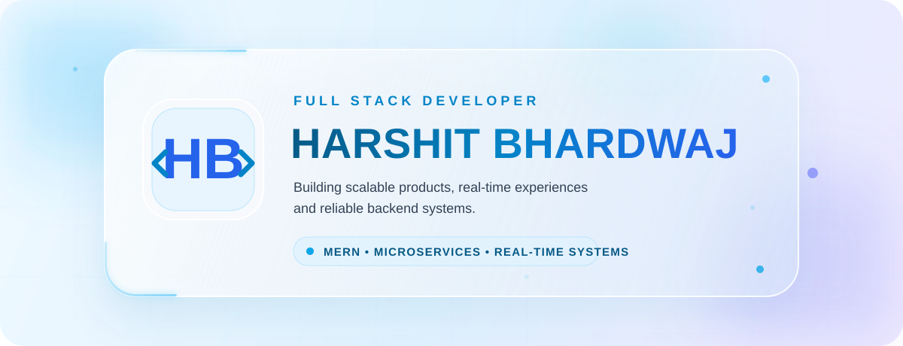

<div align="center">



<br/>

<a href="https://harshit-fullstack.vercel.app"></a>
<a href="https://www.linkedin.com/in/harshit-bhardwaj-125324287"></a>
<a href="mailto:bharshit63880@gmail.com"></a>
<a href="https://github.com/bharshit63880?tab=repositories"></a>

<br/><br/>


</div>

---

## About me

<table>
<tr>
<td width="58%" valign="top">

I am a Full Stack Developer focused on building complete digital products—from responsive React interfaces to secure Node.js APIs and event-driven backend services. I work across authentication, payments, dashboards, real-time communication and microservice workflows using MongoDB, Redis, Kafka and Docker. I value clear architecture, maintainable code and user experiences that feel fast and intentional. I am currently open to Full Stack Developer and Software Engineer opportunities where I can contribute to meaningful products and keep growing as an engineer.

</td>
<td width="42%" valign="top">

```javascript
const harshit = {
  role: "Full Stack Developer",
  location: "Jhansi, India",
  focus: ["Scalable APIs", "Real-Time Systems", "Microservices"],
  learning: ["System Design", "Cloud", "DevOps"],
  status: "Open to opportunities"
};
```

</td>
</tr>
</table>

<table>
<tr>
<td width="50%" valign="top">

### Scalable Backend
Modular APIs, authentication, RBAC, caching and event-driven services.

</td>
<td width="50%" valign="top">

### Modern Frontend
Responsive React interfaces with accessible, component-driven experiences.

</td>
</tr>
<tr>
<td width="50%" valign="top">

### Real-Time Systems
Chat, presence, notifications and live updates with WebSockets and messaging.

</td>
<td width="50%" valign="top">

### Development Workflow
Git, Docker, API testing and repeatable local-to-deployment workflows.

</td>
</tr>
</table>

<br/>

## Technology stack

<table>
<tr>
<td width="50%" valign="top">

### Languages


### Frontend


### Databases


</td>
<td width="50%" valign="top">

### Backend


### Real-Time & Messaging

<br/>


### DevOps & Tools


</td>
</tr>
</table>

<div align="center">


</div>

<br/>

## Featured projects

<table>
<tr>
<td width="50%" valign="top">

### AllSpark
**Microservices-based coding and evaluation platform.**

- Secure OTP authentication and role-based access
- Judge0-powered code execution and submissions
- Real-time contests and live leaderboards
- Kafka events, Redis caching and Docker Compose

`React` `Node.js` `Kafka` `Redis` `Docker` `Judge0`

**Status:** Active development · Runs locally with Docker

<a href="https://github.com/bharshit63880/AllSpark"></a>

</td>
<td width="50%" valign="top">

### PulseChat
**Secure messaging across responsive web and mobile clients.**

- Encrypted direct chats and verified accounts
- Group conversations, reactions and media sharing
- Presence, typing, delivery and seen states
- Offline-first outbox and notification workflows

`TypeScript` `React` `Node.js` `Socket.IO` `MongoDB`

**Status:** Active · Web deployment available

<a href="https://github.com/bharshit63880/PULSECHAT"></a>
<a href="https://pulsechat-web-rose.vercel.app"></a>

</td>
</tr>
<tr>
<td width="50%" valign="top">

### DigiPandit
**Marketplace for spiritual services, consultations and commerce.**

- Pandit and astrologer discovery with booking flows
- Astrology chat, calls and consultation continuity
- Puja store, orders and payment workflows
- User, expert and admin dashboards

`React` `Node.js` `MongoDB` `Socket.IO` `Razorpay`

**Status:** Active · Web and REST API deployed

<a href="https://github.com/bharshit63880/DIGIPANDIT"></a>
<a href="https://digipandit-web.vercel.app"></a>

</td>
<td width="50%" valign="top">

### Sastify
**Full-stack e-commerce experience for shoppers and admins.**

- Product discovery, filtering and responsive storefront
- Authentication, cart and wishlist management
- Checkout, payments and order tracking
- Inventory and administrative workflows

`React` `Node.js` `Express` `MongoDB` `Redux`

**Status:** Active · Frontend deployment available

<a href="https://github.com/bharshit63880/Sastify"></a>
<a href="https://sastify-frontend.vercel.app"></a>

</td>
</tr>
</table>

<details>
<summary><strong>Other project</strong></summary>
<br/>

**SatyaShield** — an in-progress anti-dowry safety platform exploring confidential reporting, NGO routing, emergency workflows and administrative analytics.

<a href="https://github.com/bharshit63880/SatyaShield"></a>

</details>

<br/>

## Engineering activity

<div align="center">

<picture>
  <source media="(prefers-color-scheme: dark)" srcset="https://streak-stats.demolab.com?user=bharshit63880&hide_border=true&background=00000000&ring=38BDF8&fire=0EA5E9&currStreakLabel=38BDF8&sideLabels=CBD5E1&currStreakNum=F8FAFC&sideNums=F8FAFC&dates=94A3B8" />
  <source media="(prefers-color-scheme: light)" srcset="https://streak-stats.demolab.com?user=bharshit63880&hide_border=true&background=00000000&ring=0284C7&fire=0EA5E9&currStreakLabel=0284C7&sideLabels=334155&currStreakNum=0F172A&sideNums=0F172A&dates=64748B" />
  
</picture>

<br/><br/>

<picture>
  <source media="(prefers-color-scheme: dark)" srcset="https://github-readme-activity-graph.vercel.app/graph?username=bharshit63880&bg_color=00000000&color=CBD5E1&line=38BDF8&point=F8FAFC&area=true&hide_border=true" />
  <source media="(prefers-color-scheme: light)" srcset="https://github-readme-activity-graph.vercel.app/graph?username=bharshit63880&bg_color=00000000&color=334155&line=0EA5E9&point=2563EB&area=true&hide_border=true" />
  
</picture>

</div>

<br/>

## Currently exploring

<div align="center">


</div>

<br/>

---

<div align="center">

## Open to Full Stack Developer and Software Engineer opportunities.

If you are building a thoughtful product and need someone who can work across frontend, backend and real-time systems, let’s connect.

<br/>

<a href="mailto:bharshit63880@gmail.com"></a>
<a href="https://www.linkedin.com/in/harshit-bhardwaj-125324287"></a>
<a href="https://harshit-fullstack.vercel.app"></a>

<br/><br/>


</div>
