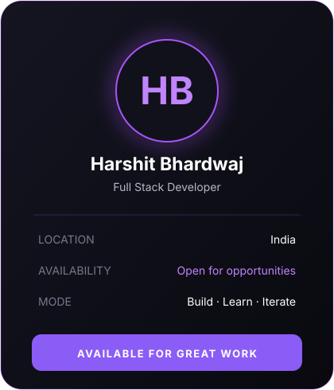
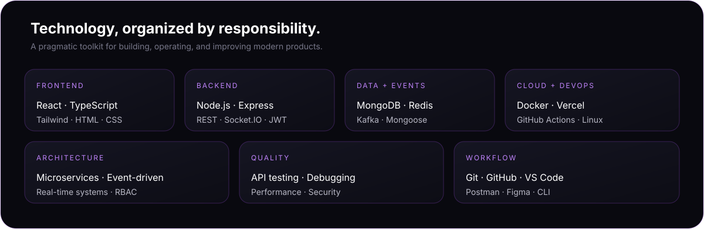
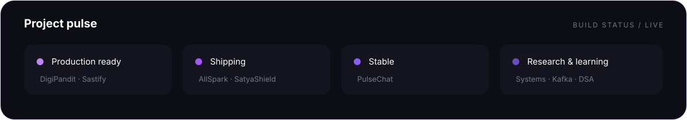
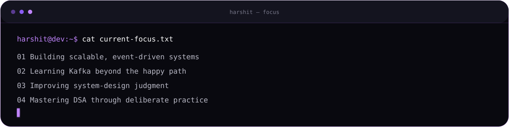

 

&nbsp;
&nbsp;

 

## About / the builder behind the systems

<table>
<tr>
<td width="35%" valign="top">

</td>
<td width="65%" valign="top">

### I turn complex ideas into dependable products.

I’m a full-stack developer focused on the space where thoughtful interfaces meet resilient backend systems. I care about the invisible details: clean boundaries, predictable data flow, secure APIs, and experiences that feel effortless.

| PRINCIPLE | HOW I WORK |
|:--|:--|
| **Problem solving** | Break ambiguity into small, testable decisions. |
| **Clean architecture** | Build boundaries that let products evolve safely. |
| **Backend depth** | Design secure APIs, events, queues, and real-time flows. |
| **Frontend craft** | Make fast, accessible interfaces with intentional detail. |
| **System thinking** | Balance reliability, scale, cost, and developer experience. |
| **Learning mindset** | Study deeply, ship often, and refine from feedback. |

</td>
</tr>
</table>

 

## Stack / tools chosen for the problem

 

## Selected work / systems with a point of view

<table>
<tr>
<td width="50%" valign="top">

### 01 — AllSpark
**Distributed coding platform**

Microservices-based platform for secure code execution, live contests, automated judging, and real-time leaderboards.

`Node.js` `Kafka` `Redis` `MongoDB` `Docker` `Judge0`

**Architecture** Event-driven microservices 
**Standout** Live evaluation + contest streams 
**Status** Active development · High complexity

<a href="https://github.com/bharshit63880/AllSpark"><strong>VIEW SOURCE →</strong></a>

</td>
<td width="50%" valign="top">

### 02 — PulseChat
**Secure real-time communication**

Encrypted direct and group messaging with verified accounts, media delivery, presence, and offline-first flows.

`TypeScript` `Socket.IO` `Node.js` `MongoDB` `JWT`

**Architecture** Real-time client/server 
**Standout** Encrypted, resilient delivery 
**Status** Production · High complexity

<a href="https://github.com/bharshit63880/PULSECHAT"><strong>VIEW SOURCE →</strong></a> · <a href="https://pulsechat-web-rose.vercel.app"><strong>LIVE DEMO ↗</strong></a>

</td>
</tr>
<tr>
<td width="50%" valign="top">

### 03 — DigiPandit
**Spiritual services marketplace**

Trusted booking ecosystem connecting users with verified pandits and astrology experts for online and offline services.

`React` `Node.js` `Express` `MongoDB` `Payments`

**Architecture** Marketplace platform 
**Standout** Multi-role service workflow 
**Status** Production ready · Advanced

<a href="https://github.com/bharshit63880/DIGIPANDIT"><strong>VIEW SOURCE →</strong></a> · <a href="https://digipandit-web.vercel.app"><strong>LIVE DEMO ↗</strong></a>

</td>
<td width="50%" valign="top">

### 04 — Sastify
**Modern commerce experience**

Responsive MERN storefront with product discovery, filtering, secure accounts, cart flows, and efficient state handling.

`React` `Tailwind` `Node.js` `Express` `MongoDB`

**Architecture** Component-driven MERN 
**Standout** Fast product discovery 
**Status** Production ready · Advanced

<a href="https://github.com/bharshit63880/Sastify"><strong>VIEW SOURCE →</strong></a> · <a href="https://sastify-frontend.vercel.app"><strong>LIVE DEMO ↗</strong></a>

</td>
</tr>
</table>

<table>
<tr>
<td width="100%" valign="top">

### 05 — SatyaShield
**Privacy-first social impact platform**

Protected anti-dowry reporting with secure evidence workflows, role-based case coordination, NGO routing, real-time chat, and internal SOS support.

`React` `Node.js` `MongoDB` `Socket.IO` `RBAC` · **Service architecture** · **Privacy-first workflows** · **Active development** · **High complexity**

<a href="https://github.com/bharshit63880/SatyaShield"><strong>VIEW SOURCE →</strong></a> · <a href="https://satya-shield-client.vercel.app"><strong>LIVE DEMO ↗</strong></a>

</td>
</tr>
</table>

 

 

## Now / deliberate growth in public

 

## Signal / a quiet look at the work

<picture>
  <source media="(prefers-color-scheme: dark)" srcset="https://github-readme-stats.vercel.app/api?username=bharshit63880&show_icons=true&hide_border=true&bg_color=09090F&title_color=C084FC&text_color=B8B8C5&icon_color=8B5CF6&ring_color=A855F7" />
  
</picture>
<picture>
  <source media="(prefers-color-scheme: dark)" srcset="https://github-readme-stats.vercel.app/api/top-langs/?username=bharshit63880&layout=compact&hide_border=true&bg_color=09090F&title_color=C084FC&text_color=B8B8C5" />
  
</picture>

  

 

## Let’s build something remarkable.

Have an ambitious product, a hard systems problem, or an idea worth shipping? I’m open to thoughtful collaborations and full-stack opportunities.

 

  

“Build with clarity. Scale with intent.”

