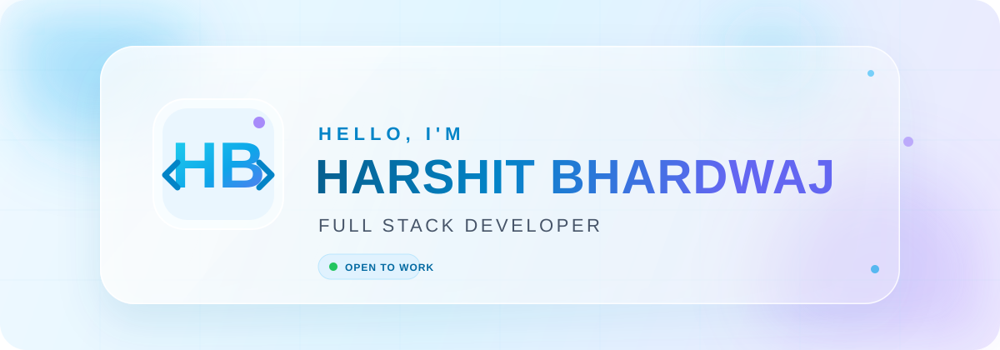

<div align="center">



<br/>


<br/><br/>

<a href="https://harshit-fullstack.vercel.app"></a>
<a href="https://www.linkedin.com/in/harshit-bhardwaj-125324287"></a>
<a href="mailto:bharshit63880@gmail.com"></a>
<a href="https://github.com/bharshit63880?tab=repositories"></a>

<br/><br/>


</div>

---

## 👋 About me

```typescript
const harshit = {
  role: "Full Stack Developer",
  location: "Jhansi, Uttar Pradesh, India",
  focus: ["Scalable APIs", "Microservices", "Real-Time Systems"],
  stack: ["React", "Node.js", "TypeScript", "MongoDB"],
  systems: ["Kafka", "Redis", "Socket.IO", "Docker"],
  mindset: "Build reliable software that creates real value"
};
```

I turn product ideas into reliable, responsive and scalable applications. My work spans modern React interfaces, secure APIs, real-time communication, distributed services and developer-friendly deployment workflows.

> I care about clean architecture, thoughtful user experience and software that remains maintainable after launch.

<br/>

## ✦ What I bring

<table>
<tr>
<td width="50%" valign="top">

### ⚡ Product Engineering

From requirements to production—responsive interfaces, authentication, payments, dashboards and complete user journeys.

</td>
<td width="50%" valign="top">

### ◈ Scalable Backends

Modular REST APIs, role-based access, caching, queues and event-driven services designed for reliability.

</td>
</tr>
<tr>
<td width="50%" valign="top">

### ◉ Real-Time Experiences

Chat, presence, notifications, live contests and WebSocket workflows powered by Socket.IO, Redis and Kafka.

</td>
<td width="50%" valign="top">

### ⬡ Engineering Workflow

Git-driven collaboration, Dockerized environments, API testing and clean component-based development.

</td>
</tr>
</table>

<br/>

## 🧰 Technology stack

<div align="center">


<br/><br/>


<br/><br/>


</div>

<br/>

## 🚀 Featured projects

<table>
<tr>
<td width="50%" valign="top">

### ⚙️ AllSpark

**Online Coding & Evaluation Platform**

Microservices-based coding platform with secure authentication, automated Judge0 execution, live contests, leaderboards and admin controls.

`Node.js` `React` `Kafka` `Redis` `Docker` `Judge0`

<a href="https://github.com/bharshit63880/AllSpark"></a>

</td>
<td width="50%" valign="top">

### 💬 PulseChat

**Secure Real-Time Messenger**

End-to-end encrypted direct messaging with verified accounts, group chat, media sharing and responsive web/mobile clients.

`TypeScript` `React` `Node.js` `Socket.IO` `MongoDB`

<a href="https://pulsechat-web-rose.vercel.app"></a>
<a href="https://github.com/bharshit63880/PULSECHAT"></a>

</td>
</tr>
<tr>
<td width="50%" valign="top">

### 🛕 DigiPandit

**Spiritual Services Marketplace**

Multi-role marketplace for puja bookings, astrology consultations, devotional shopping, payments, chat and expert dashboards.

`React` `Node.js` `MongoDB` `Socket.IO` `Razorpay`

<a href="https://digipandit-web.vercel.app"></a>
<a href="https://github.com/bharshit63880/DIGIPANDIT"></a>

</td>
<td width="50%" valign="top">

### 🛍️ Sastify

**Full-Stack E-Commerce Platform**

Responsive shopping experience with authentication, product discovery, cart, wishlist, payments, order management and admin workflows.

`React` `Node.js` `Express` `MongoDB` `Redux` `Stripe`

<a href="https://sastify-frontend.vercel.app"></a>
<a href="https://github.com/bharshit63880/Sastify"></a>

</td>
</tr>
</table>

<div align="center">

<a href="https://github.com/bharshit63880?tab=repositories"></a>

</div>

<br/>

## 📊 Engineering activity

<div align="center">


<br/><br/>


</div>

<br/>

## 🎯 Currently focused on

- Architecting modular, production-ready microservices
- Improving system-design and distributed-systems fundamentals
- Building secure, high-performance APIs and real-time products
- Exploring cloud deployment, DevOps and AI-powered product features

<br/>

<div align="center">

### Let’s build something meaningful.

I’m open to **Full Stack Developer** and **Software Engineer** opportunities, freelance projects and thoughtful collaborations.

<br/>

<a href="mailto:bharshit63880@gmail.com"></a>
<a href="https://harshit-fullstack.vercel.app"></a>

<br/><br/>

<sub>Designed with clarity, built with care, and always evolving.</sub>

</div>


